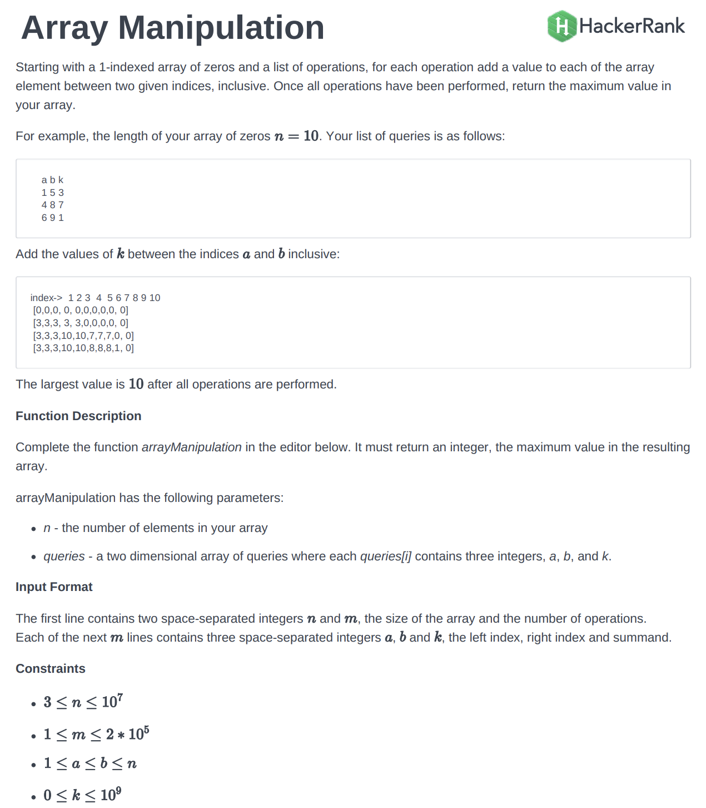
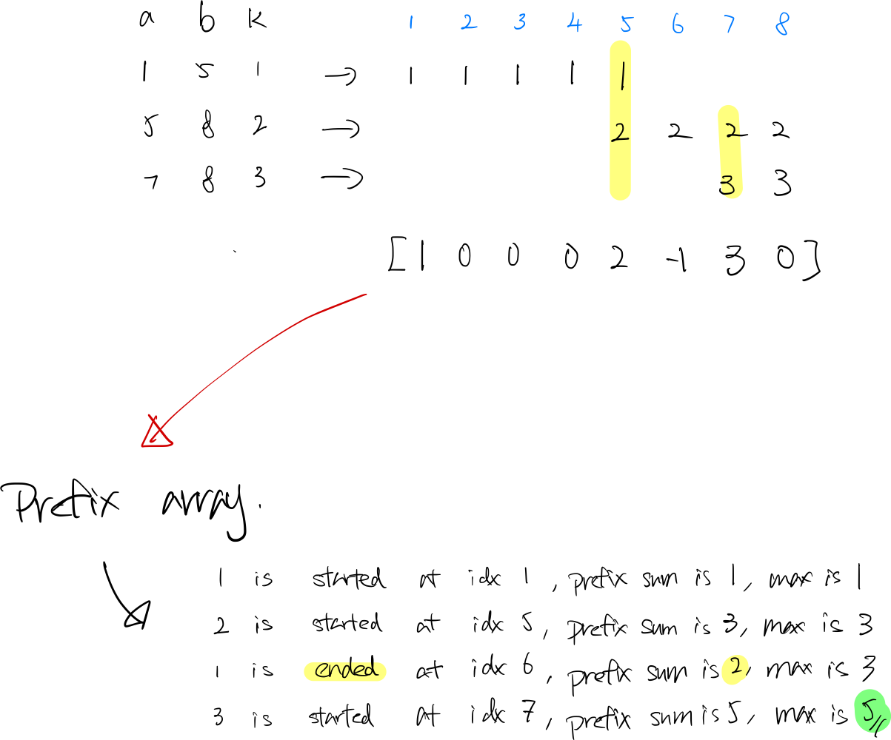

### Question

)

- **Prefix sum**

    ```tsx
    function prefixSum(n, queries) {
        const arr = new Array(n + 2).fill(0);
        // add prefix to arr[a] += k, arr[b + 1]
        for(let i = 0; i < queries.length; i++) {
            const [a, b, k] = queries[i];
            arr[a] += k;
            arr[b + 1] -= k;
        }
        // calculate prefix sum, find the largest sum, O(n)
        let sum = 0;
        let largest = 0;
        for (let i = 0; i < arr.length; i++) {
            sum += arr[i];
            largest = Math.max(sum, largest);
        }

        return largest;
    }
    ```

    **How does it work?**

    )
    **Analysis**

    It loops thru the `m` length queries array to add prefix to a `n` length array to store the prefix, then loop thru the array to get the maximum prefix sum, the `time complexity is O(n + m)`, `space complexity is O(n)`.

    **Time Complexity:** O(m + n)

    **Space Complexity:** O(n)

- **Optimal Prefix sum**

    ```tsx
    function optimalPrefixSum(n, queries) {
        const prefixPairs = {};
        // add (a, k) (b, -k) to prefixPairs
        for(let i = 0; i < queries.length; i++) {
            const [a, b, k] = queries[i];
            if (!prefixPairs[a]) prefixPairs[a] = 0;
            if (!prefixPairs[b + 1]) prefixPairs[b + 1] = 0;
            prefixPairs[a] += k;
            prefixPairs[b + 1] += -k;
        }
        // sort prefixPairs, O(m log m)
        const keys = Object.keys(prefixPairs).sort((a, b) => a - b);
        let sum = 0;
        let largest = 0;
        for (let i = 0; i < keys.length; i++) {
            sum += prefixPairs[keys[i]];
            largest = Math.max(sum, largest);
        }
        return largest;
    }
    ```

    **How does it work?**

    The idea is similar to above solution, but here, it only stores the prefix in a map, where is size of map is `2m` (each query split in to 2 pairs [a, k] and [b + 1, -k]). 

    Then, it sorts the array `O(2m log 2m)` and loops thru map `O(2m)`, and find the max prefix sum. 

    This a optimal version, since:

    - 1 ≤ m ≤ 2 * 10 ^ 5
    - 3 ≤ n ≤ 10 ^ 7

    In the worst case, n is 10^7 and m is 2 * 10^5, n > m.

    **Analysis**

    **Time Complexity:**  O(m) + O(2m log 2m) + O(2m) ⇒ O(m log m)

    **Space Complexity:** O(2m)