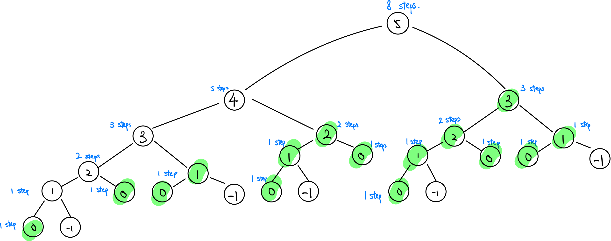

### Question

You are climbing a staircase. It takes `n` steps to reach the top.

Each time you can either climb `1` or `2` steps. In how many distinct ways can you climb to the top?

**Example 1:**

```
Input: n = 2
Output: 2
Explanation: There are two ways to climb to the top.
1. 1 step + 1 step
2. 2 steps

```

**Example 2:**

```
Input: n = 3
Output: 3
Explanation: There are three ways to climb to the top.
1. 1 step + 1 step + 1 step
2. 1 step + 2 steps
3. 2 steps + 1 step

```

**Constraints:**

- `1 <= n <= 45`
- **Solution**

    ```tsx
    function climbStairs(n: number): number {
        const cache = [1, 1];
        for (let i = 2; i <= n; i++) {
            let oneStep = cache[i - 1];
            let twoStep = cache[i - 2];
            cache.push(oneStep + twoStep)
        }
        return cache[n]
    };
    ```

    **How does it work?**

    This can be done iteratively or recursively, the idea is the same, here, I am using iteration. 

    In order to solve this question, we should first start with thinking the sub problem. 

    E.g. 

    1. How many ways we can take to stair 1 from stair 0? The answer is 1, because we can only take 1 step.
    2. How many ways we can take to stair 2 from stair 1? 
    
        The answer is **1**, what about from stair 0? The answer is **2**.
        
        We can either take 1 one-step from stair 1 and then another one-step from stair 0 to stair 0, or 1 two-step from 0.

    Based on the sub problem, we can conclude that if we want to know how many ways that we can take from stair 0 to stair N, we have to answer the sub problems:

    1. How many ways we can take from stair 0 to stair `N-1`?
    2. How many ways we can take from stair 0 to stair `N-2`?

    

    The `highlighted` are nodes that have been visited more than 1 times. To reduce the time complexity (visiting the same node again), we can cache the visited node values and reuse the calculated values. This a common approach that sacrifice the memory to reduce the time complexity.

    **Analysis**

    **Time Complexity:** O(n)

    **Space Complexity:** O(n)

**Lesson Learnt**

- If you can leverage the big problem by solving the sub problems.
- Store the visited node value to reduce time complexity, so called **Dynamic Programming**