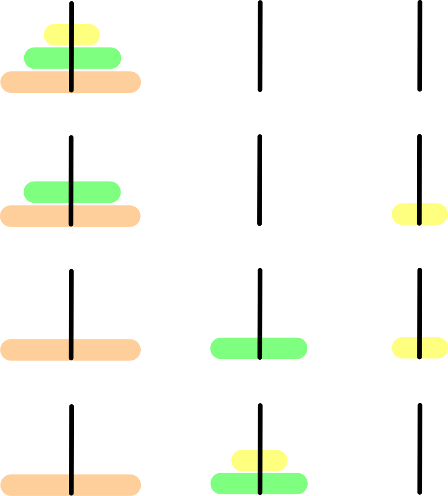
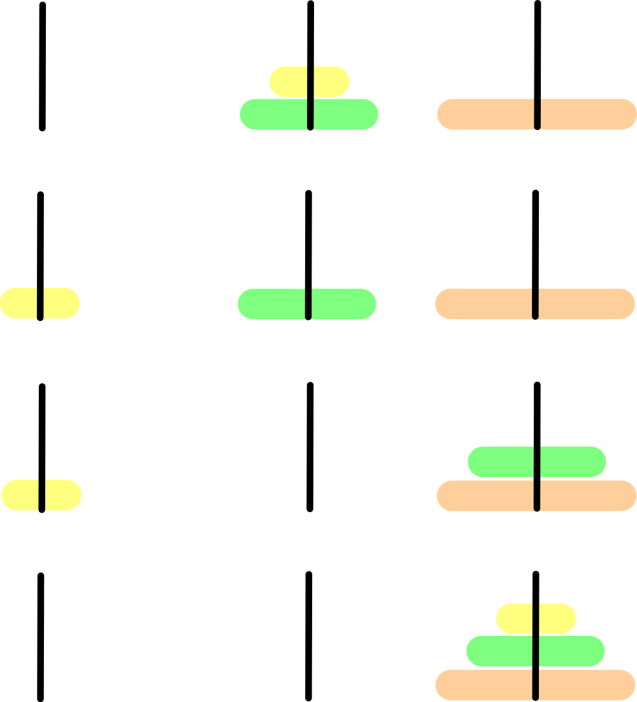

### Question

Tower of Hanoi, is a mathematical puzzle which consists of three towers (pegs) and more than one rings is as depicted −


These rings are of different sizes and stacked upon in an ascending order, i.e. the smaller one sits over the larger one. There are other variations of the puzzle where the number of disks increase, but the tower count remains the same.

## Rules

The mission is to move all the disks to some another tower without violating the sequence of arrangement. A few rules to be followed for Tower of Hanoi are −

- Only one disk can be moved among the towers at any given time.
- Only the "top" disk can be removed.
- No large disk can sit over a small disk.

Following is an animated representation of solving a Tower of Hanoi puzzle with three disks.


Tower of Hanoi puzzle with n disks can be solved in minimum **2^n−1** steps. This presentation shows that a puzzle with 3 disks has taken **2^3 - 1 = 7** steps.

- **Solution**

    ```tsx
    (function main() {
        let n = 3;
        solveHanoiTower(n, 1, 3);
    }());

    function solveHanoiTower(n: number, start: number, end: number) {
        if (n == 1) {
            // base case
            console.log(`Disk ${n}: ${start} => ${end}`)
        } else {
            // find the free rod
            let other = 6 - (start + end);
            // move n - 1 disks to the free rod
            solveHanoiTower(n - 1, start, other);
            // move n-th disk to the target rod
            console.log(`Disk ${n}: ${start} => ${end}`)
            // move n - 1 disks to the final target rod
            solveHanoiTower(n - 1, other, end);
        }
    }
    ```

    **How does it work?**

    The Hanoi Tower puzzle is a typical `Divide and Conquer` Algorithm. We solve the small sub problem to answer the complex problem.

    1. How to solve the puzzle when there is only one disk?
        - We move it directly form the start rod to the end rod.
    2. How to solve the 2 disks puzzle?
        - The 1st disk is on the top of the 2nd disk
        - Free the 2nd disk by moving the 1st disk to the free rod
        - The 2nd is is free, move it to the target rod.
        - Finally, we can move the 1st disk to target rod.

    Now, we have the basic ideas:

    1. If there is only one disk, move to the target rod.
    2. To free the n-th disk, move 1 to n-1 disks to the free rod.

    Let see how we can solve a 3-disk Hanoi Tower with the above ideas:

    - To free the 3rd disk, we need to move 1st and 2nd disks to the middle(free) rod
        - So, now forget the 3rd disk, only goal now is to move a 2-disk hanoi tower from rod 1 to rod 2.
        - To further break down sub problem into the base case, we want to move a 1-disk hano tower from rod 1 to rod 3.
        - After that, disk 2 is free to move from rod 1 to rod 2. To finish the 2-disk hanoi tower, we need to move the disk 1 from rod 3 to rod 2. We just solved the a 2-disk hanoi tower.

    

    3rd disk is free to move from rod 1 to target rod 3 now. Then, we now have to solve another 2-disk tower from rod 2 to rod 3. Do you see the pattern? That's the key to solve this problem.

    

    Finally, after we move the 1st and 2nd disk to the target rod, a 3-disk hanoi tower is solved.

    **Analysis**

    **Time Complexity:** O(2^n - 1)

    **Space Complexity:** O(1)

**Lesson Learnt**

-