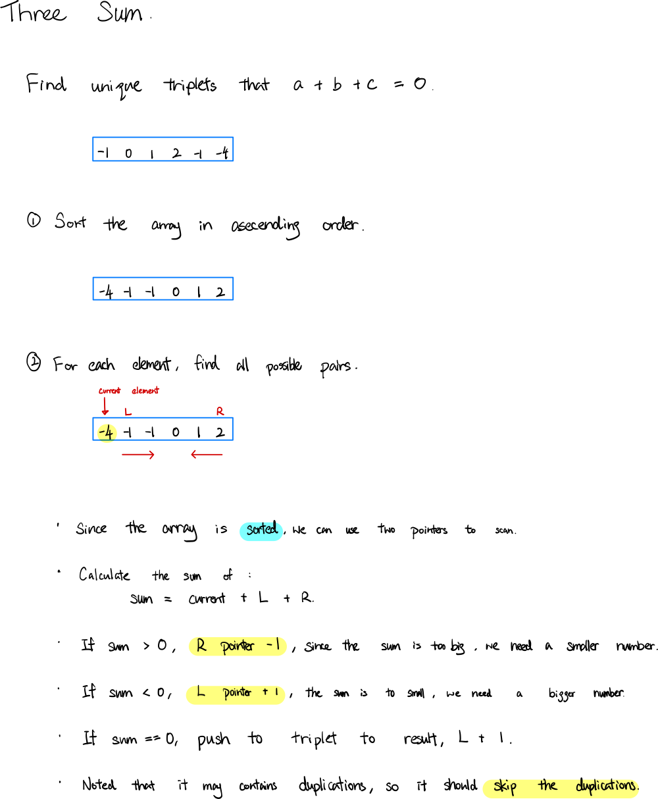

### Question

Given an array `nums` of *n* integers, are there elements *a*, *b*, *c* in `nums` such that *a* + *b* + *c* = 0? Find all unique triplets in the array which gives the sum of zero.

Notice that the solution set must not contain duplicate triplets.

**Example 1:**

```
Input: nums = [-1,0,1,2,-1,-4]
Output: [[-1,-1,2],[-1,0,1]]
```

**Example 2:**

```
Input: nums = []
Output: []
```

**Example 3:**

```
Input: nums = [0]
Output: []
```

**Constraints:**

- `0 <= nums.length <= 3000`
- `105 <= nums[i] <= 105`

- **Solution**

    ```tsx
    function threeSum(nums: number[]): number[][] {
        if (nums.length == 0) return [];
        if (nums.length < 3) return [];
        
        // sort the array
        // e.g. [-4, -1, -1, 0, 1, 2]
        nums.sort((a, b) => a - b);
        
        let result = [];
        
        for(let i = 0; i < nums.length; i++) {
    				// skip duplications
            if (i > 0 && nums[i] == nums[i - 1]) continue;
            let left = i + 1;
            let right = nums.length - 1;
            
            // two pointers
            while (right > left) {
                let sum = nums[i] + nums[left] + nums[right];
                
                if (sum == 0) {
                    // triplet found
                    result.push([nums[i], nums[left], nums[right]]);
                    left++;
                    
                    // skip duplications
                    while (left < right && nums[left] === nums[left - 1]) left++;
                } else if (sum > 0) {
                    right--;
                } else {
                    left++;
                }
            }
        }
        
        return result;
        
    };
    ```

    **How does it work?**

    

    **Analysis**

    **Time Complexity:** O(n^2)

    **Space Complexity:** O(1) not including the variable result

**Lesson Learnt**

- Try to solve the sub-problem

    ⇒ Three sum, then what about 2 sum?

- Need to get familiar with Two pointer approach.