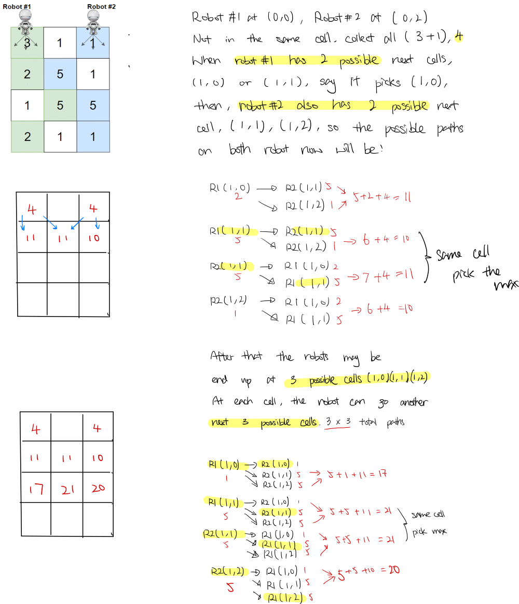

### Question

Given a `rows x cols` matrix `grid` representing a field of cherries. Each cell in `grid` represents the number of cherries that you can collect.

You have two robots that can collect cherries for you, Robot #1 is located at the top-left corner (0,0) , and Robot #2 is located at the top-right corner (0, cols-1) of the grid.

Return the maximum number of cherries collection using both robots  by following the rules below:

- From a cell (i,j), robots can move to cell (i+1, j-1) , (i+1, j) or (i+1, j+1).
- When any robot is passing through a cell, It picks it up all cherries, and the cell becomes an empty cell (0).
- When both robots stay on the same cell, only one of them takes the cherries.
- Both robots cannot move outside of the grid at any moment.
- Both robots should reach the bottom row in the `grid`.

**Example 1:**


```
Input: grid = [[3,1,1],[2,5,1],[1,5,5],[2,1,1]]
Output: 24
Explanation: Path of robot #1 and #2 are described in color green and blue respectively.
Cherries taken by Robot #1, (3 + 2 + 5 + 2) = 12.
Cherries taken by Robot #2, (1 + 5 + 5 + 1) = 12.
Total of cherries: 12 + 12 = 24.
```

**Example 2:**


```
Input: grid = [[1,0,0,0,0,0,1],[2,0,0,0,0,3,0],[2,0,9,0,0,0,0],[0,3,0,5,4,0,0],[1,0,2,3,0,0,6]]
Output: 28
Explanation: Path of robot #1 and #2 are described in color green and blue respectively.
Cherries taken by Robot #1, (1 + 9 + 5 + 2) = 17.
Cherries taken by Robot #2, (1 + 3 + 4 + 3) = 11.
Total of cherries: 17 + 11 = 28.
```

**Example 3:**

```
Input: grid = [[1,0,0,3],[0,0,0,3],[0,0,3,3],[9,0,3,3]]
Output: 22
```

**Example 4:**

```
Input: grid = [[1,1],[1,1]]
Output: 4
```

**Constraints:**

- `rows == grid.length`
- `cols == grid[i].length`
- `2 <= rows, cols <= 70`
- `0 <= grid[i][j] <= 100`

- **Solution**

    ```tsx
    function cherryPickup(grid: number[][]): number {

        const row_n = grid.length;
        const col_n = grid[0].length;
        const dp = new Array(row_n);
        
        function pickup(row: number, col1: number, col2: number) {
            // out of boundary, return 0
            if (row < 0 || row >= row_n || 
                col1 < 0 || col1 >= col_n || 
                col2 < 0 || col2 >= col_n) 
                    return 0;
            
            // init array, fill it with -1, since it might store 0
            if (!dp[row]) dp[row] = new Array(col_n);
            if (!dp[row][col1]) dp[row][col1] = new Array(col_n).fill(-1);
            
            if (dp[row][col1][col2] != -1) return dp[row][col1][col2];
            
            // Pick up all cherries in both cells if robots are not in the same cell,
            // or only one of them takes the cherries
            let cherries = grid[row][col1] + (col1 == col2 ? 0 : grid[row][col2]);
            
            let result = 0;
            
    				// Total path combinations of both robots = 3 * 3 = 9
            // Pick the max among 3 * 3 different paths,
            for (let i = -1; i < 2; i++) {
                for (let j = -1; j < 2; j++) {
                    result = Math.max(result, pickup(row + 1, col1 + i, col2 + j));
                }
            }
            
            let ans = cherries + result;
            
            dp[row][col1][col2] = ans;
            
            return ans;
        }
        
        
        return pickup(0, 0, col_n - 1);
    };
    ```

    **How does it work?**

    1. Basic idea, Calculate all paths and find the max paths.
    2. At each cell, it will go thru each possible next cells of both robots.
    3. if both robots are in the same cell, return the cell value
    4. if not, collect all the cherries in both cells
    5. Return the total cherries collected at current cell + the max subpath cherries.
    6. Repeat 2 - 5, til no more next cell.

    

    **Analysis**

    **Time Complexity: less than** O(9*r*c*2)

    **Space Complexity:** O(r * c * c)