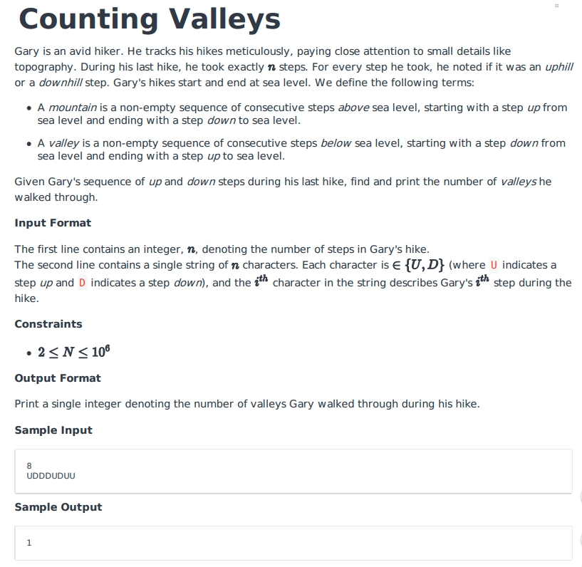
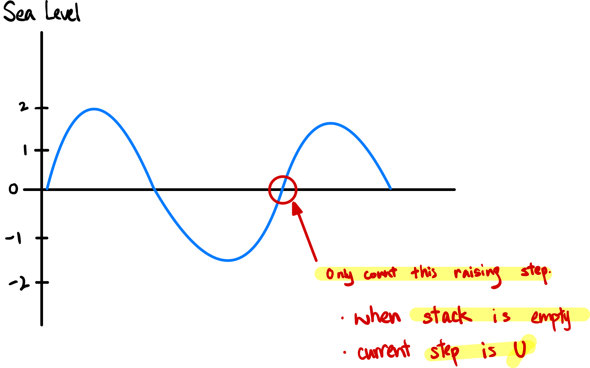
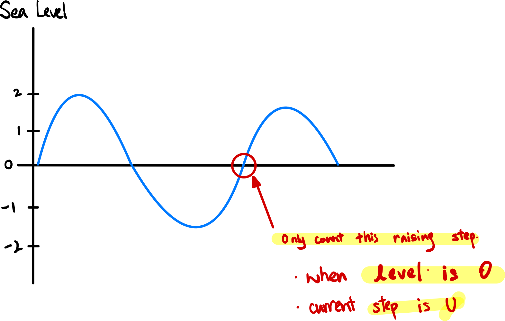

### Question



- **Using Stack**

    ```tsx
    function countingValleys(steps, path) {
        // Write your code here
        let stack = [];
        let count = 0;
        for(let i = 0; i < steps; i++) {
            let cur = path[i];
            if (stack[0]) {
                let peek = stack[stack.length-1];
                if (peek != cur) stack.pop();
                else stack.push(cur);
            } else {
                stack.push(cur);
            }
            
            if (!stack[0] && cur == 'U') count++
        }
        
        return count;
    }
    ```

    **How does it work?**

    

    **Analysis**

    **Time Complexity:** O(n)

    **Space Complexity:** O(n)

- **Simple Enough Solution**

    ```tsx
    function countingValleys(steps, path) {
        // Write your code here
        let level = 0;
        let count = 0;
        for(let i = 0; i < steps; i++) {
            if (path[i] == 'U') {
                if (level == -1) count++;
                level++;
            } else {
                level--;
            }
        }
        
        return count;
    }
    ```

    **How does it work?**

    

    Typo: Count a valley when level is -1 and current step is U

    

    **Analysis**

    - Use one variable to store the current aptitude.
    - Simple loop thru each elements

    **Time Complexity:** O(n)

    **Space Complexity:** O(1)