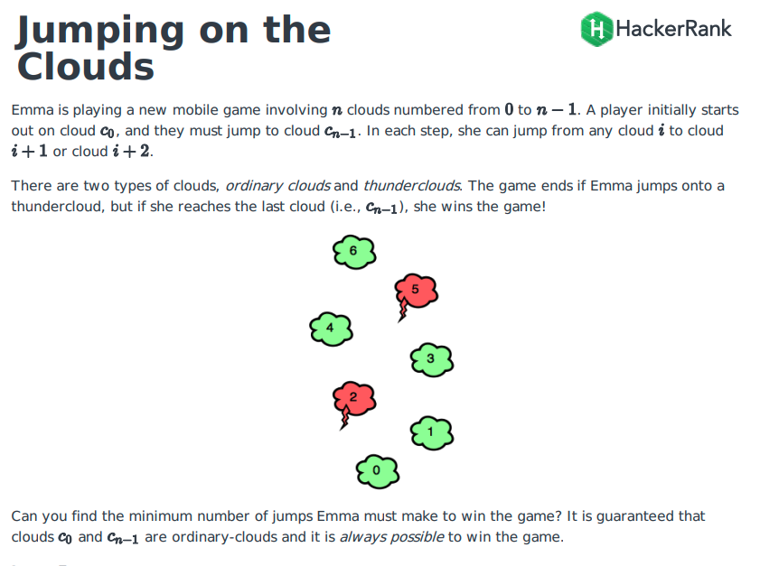
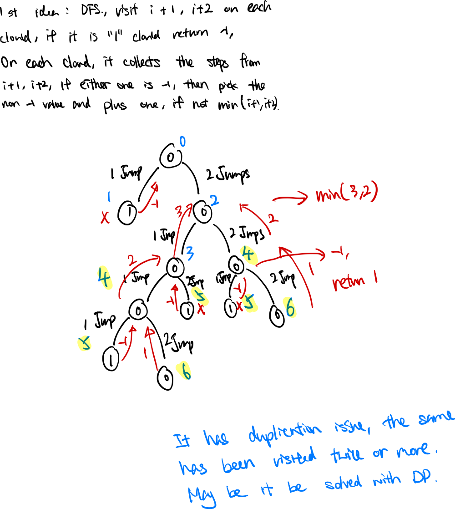
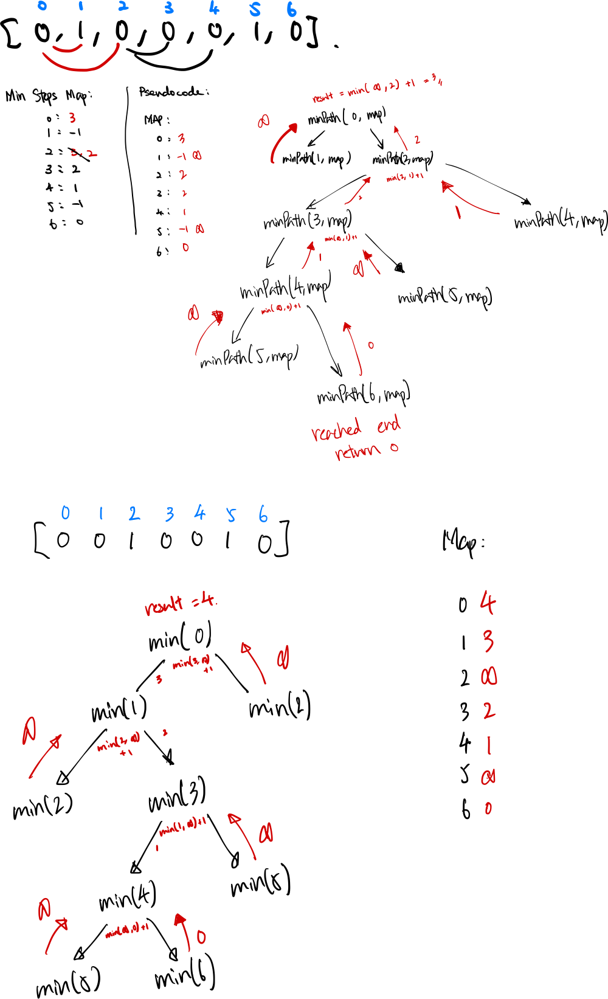
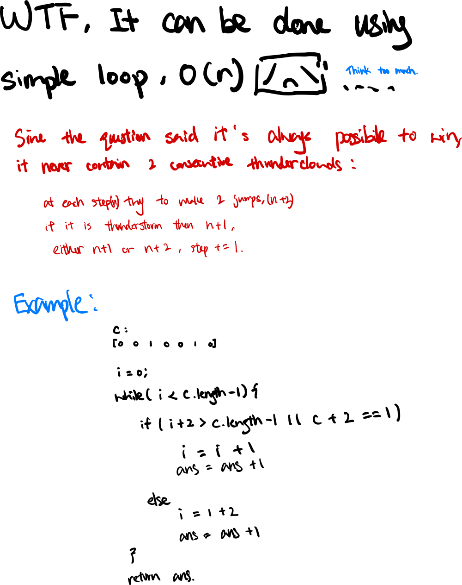

### Question



- DFS

    **How does it work?**

    

    **Analysis**

    Some clouds will be visited more than one time.

    **Time Complexity:  less than** O(2^n)

    **Space Complexity:** O(n), no extra space needed.

- **DFS + Dynamic Programing**

    ```tsx
    function jumpingOnClouds(c) {
        const map = new Map();
        const result = minJumps(c, 0, map);
        return result;
    }

    function minJumps(clouds, idx, map) {
        if (idx >= clouds.length - 1) {
            map.set(idx, 0);
            return 0;
        }
        if (clouds[idx] === 1) {
            map.set(idx, Number.MAX_SAFE_INTEGER);
            return Number.MAX_SAFE_INTEGER;
        }
        
        if (map.has(idx)) return map.get(idx);
        
        const jump1step = map.get(idx + 1) || minJumps(clouds, idx + 1, map);
        const jump2step = map.get(idx + 2) || minJumps(clouds, idx + 2, map);
        
        map.set(idx, Math.min(jump1step, jump2step) + 1);
        
        return map.get(idx);
    }
    ```

    **How does it work?**

    

    **Analysis**

    Using a map to store the visited node minimum jumps.

    **Time Complexity:  less than** O(n), each node only visited once.

    **Space Complexity:** O(n), added a map to avoid visiting the same node again.

- **Simple Enough Solution**

    ```tsx
    function jumpingOnClouds(c) {
        let i = 0;
        let ans = 0;
        
        while (i < c.length - 1) {
            if (i + 2 > c.length - 1 || c[i + 2] == 1) {
                i += 1;
            } else {
                i += 2;
            }
            ans++;
        }
        return ans;
    }
    ```

    **How does it work?**

    

    **Analysis**

    - A simple loop, visiting all elements in array once.
    - No extra space needed except the ans

    **Time Complexity:** O(n)

    **Space Complexity:** O(1)