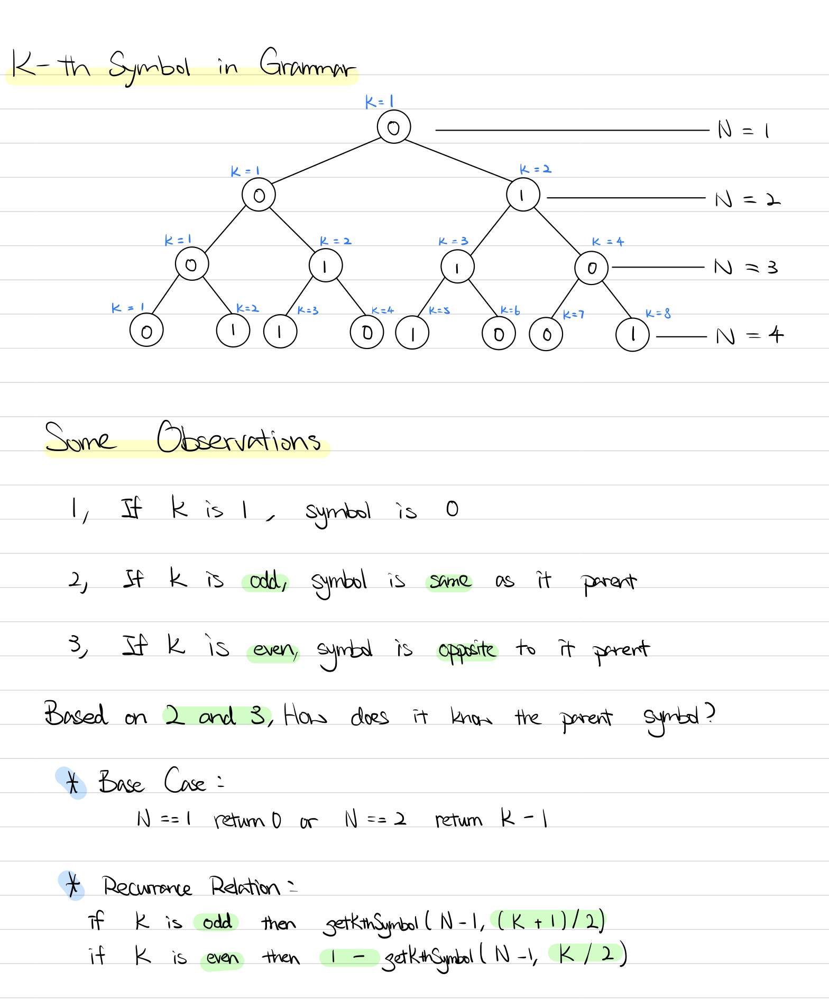

### Question

On the first row, we write a `0`. Now in every subsequent row, we look at the previous row and replace each occurrence of `0` with `01`, and each occurrence of `1` with `10`.

Given row `N` and index `K`, return the `K`-th indexed symbol in row `N`. (The values of `K` are 1-indexed.) (1 indexed).

```
Examples:Input: N = 1, K = 1
Output: 0

Input: N = 2, K = 1
Output: 0

Input: N = 2, K = 2
Output: 1

Input: N = 4, K = 5
Output: 1

Explanation:
row 1: 0
row 2: 01
row 3: 0110
row 4: 01101001
```

**Note:**

1. `N` will be an integer in the range `[1, 30]`.
2. `K` will be an integer in the range `[1, 2^(N-1)]`.

- **Solution**

    ```tsx
    function kthGrammar(N: number, K: number): number {
        return getKthSymbol(N, K);
    };

    function getKthSymbol(N: number, K: number): number {
        if (N == 1) return 0;
        if (N == 2) return K - 1;
        
        if (K % 2 === 0) return 1 - getKthSymbol(N - 1, K / 2);
        return getKthSymbol(N - 1, (K + 1) / 2);
    }
    ```

    **How does it work?**

    

    **Analysis**

    **Time Complexity:** O(n)

    **Space Complexity:** O(n)

**Lesson Learnt**

-