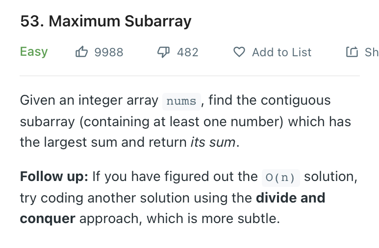
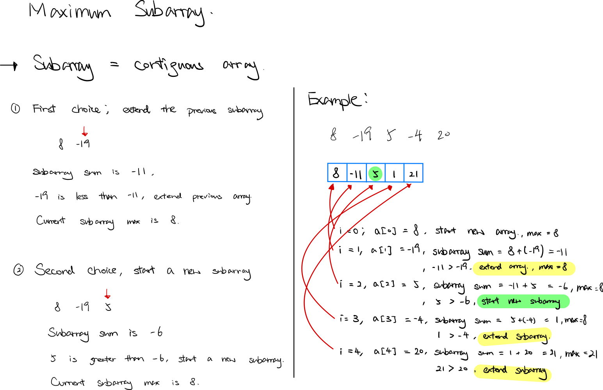

### Question



- **Solution**

    ```tsx
    function maxSubArray(nums: number[]): number {
        let current_sum = 0;
        let max = Number.MIN_SAFE_INTEGER;
        for(let i = 0; i < nums.length; i++) {
            current_sum += nums[i]
            if (nums[i] > current_sum)
                current_sum = nums[i];
            
            max = Math.max(current_sum, max);
        }
        return max;
    };
    ```

    **How does it work?**

    

    **Analysis**

    **Time Complexity:** O(n)

    **Space Complexity:** O(1)