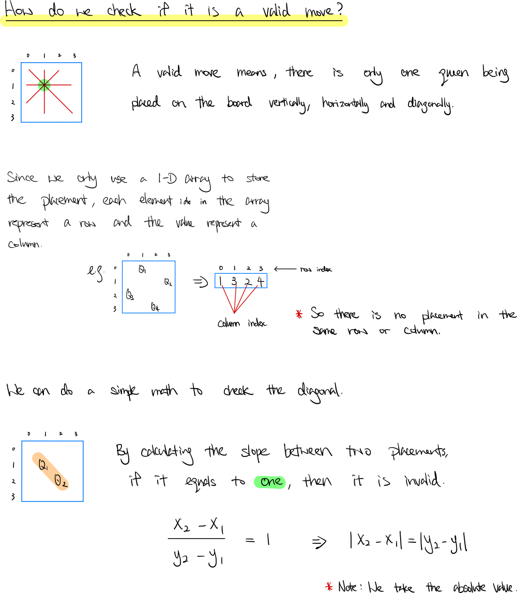
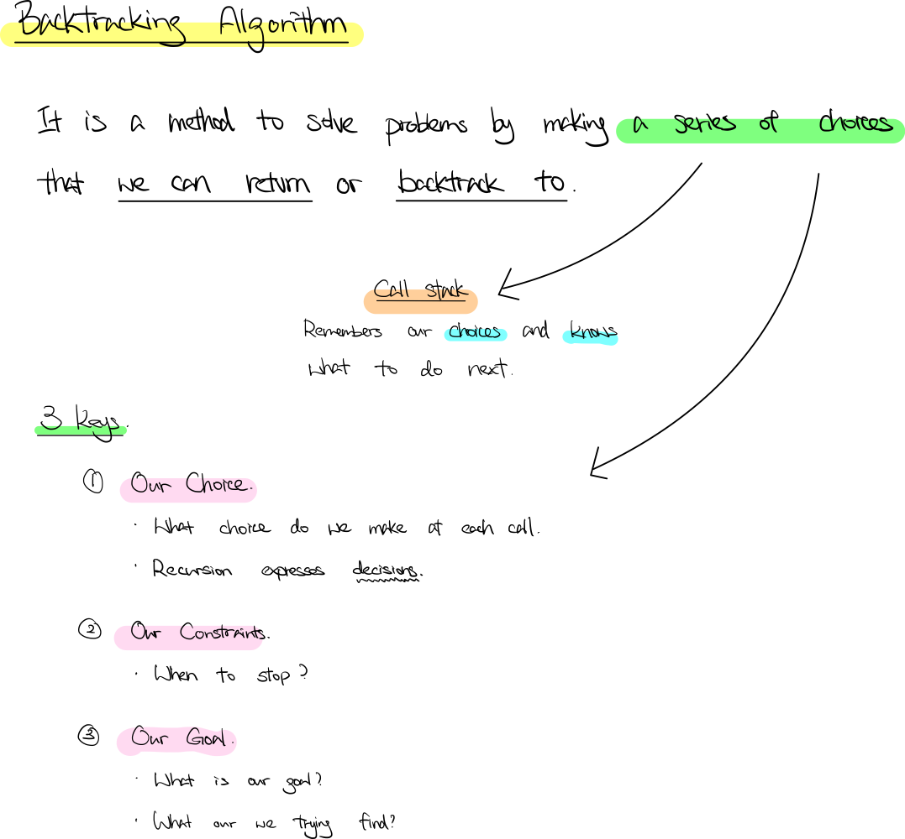

### Question

The **n-queens** puzzle is the problem of placing `n` queens on an `n x n` chessboard such that no two queens attack each other.

Given an integer `n`, return *all distinct solutions to the **n-queens puzzle***.

Each solution contains a distinct board configuration of the n-queens' placement, where `'Q'` and `'.'` both indicate a queen and an empty space, respectively.

**Example 1:**


```
Input: n = 4
Output: [[".Q..","...Q","Q...","..Q."],["..Q.","Q...","...Q",".Q.."]]
Explanation: There exist two distinct solutions to the 4-queens puzzle as shown above

```

**Example 2:**

```
Input: n = 1
Output: [["Q"]]

```

**Constraints:**

- `1 <= n <= 9`
- **Solution**

    ```tsx
    function solveNQueens(n: number): string[][] {
        let result: string[][] = []
        solveRows(n, 0, [], result);
        return result;
    };

    function solveRows(n: number, row: number, colPlacements: number[], result: string[][]) {
        if (row >= n) {
            // Our Goal
            result.push(serialize(colPlacements));
        } else {
            for (let col = 0; col < n; col++) {
                // Our Choice
                colPlacements.push(col);
                // Our Constraint
                if (isSafe(colPlacements)) solveRows(n, row + 1, colPlacements, result);
                // Undo our choice
                colPlacements.pop();
            }
        }
    };

    function isSafe(colPlacements: number[]): boolean {
        let row = colPlacements.length - 1;
        for (let i = 0; i < row; i++) {
            let diff = Math.abs(colPlacements[i] - colPlacements[row]);
            // |x2 - x1| == |y2 - y1|, means they are in the same diagonal
            // x2 = last placement column, x1 = other placement column
            // y2 = last placement column, y2 = other placement row
            if (diff == 0 || diff == row - i) return false;
        }
        return true;
    }

    function serialize(colPlacements: number[]): string[] {
        let result = [];
        for (let i = 0; i < colPlacements.length; i++) {
            const col = colPlacements[i];
            let row = '';
            for (let j = 0; j < colPlacements.length; j++) 
                row += j == col ? 'Q' : '.'
            result.push(row);
        }
        return result;
    };
    ```

    **How does it work?**

    

    

    

    **Analysis**

    **Time Complexity:** O(n)

    **Space Complexity:** O(n)

**Lesson Learnt**

- The concept of backtracking algorithm.
- Make use of call stack to remember the choices made,