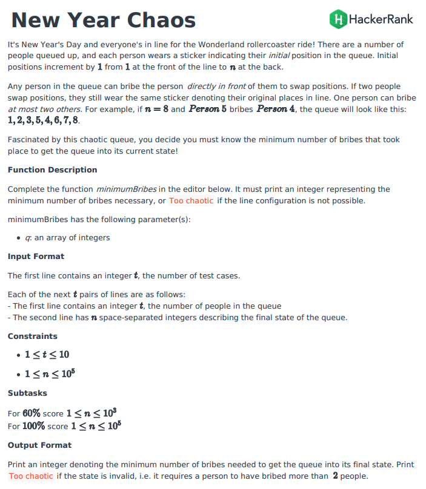
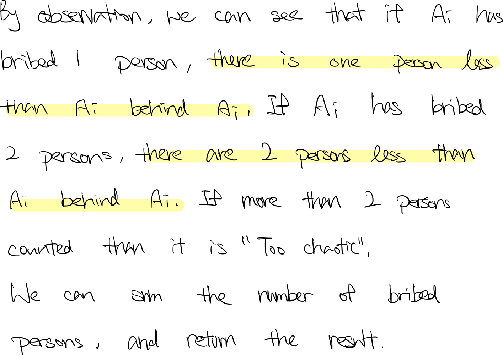
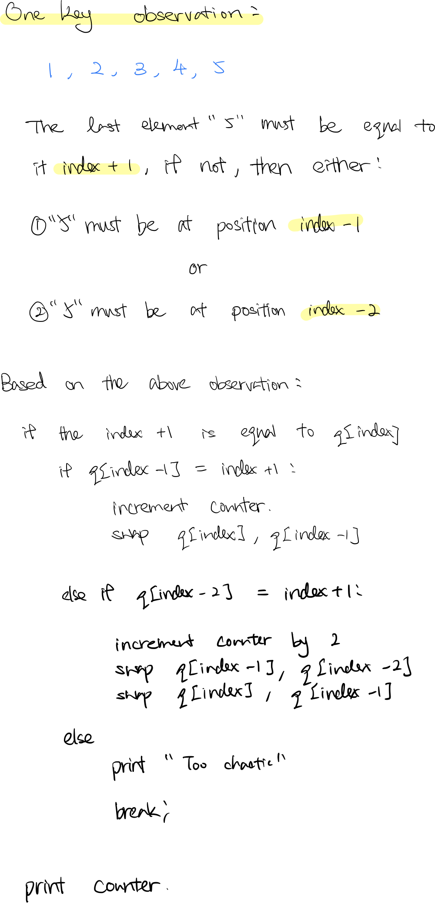

### Question

)

- **Brute force Solution**

    ```tsx
    function minimumBribes(q) {
        // brute force
        let count = 0;
        for (let i = 0; i < q.length; i++) {
            let tmp = 0;
            for (let j = i; j < q.length; j++) {
                if (q[i] > q[j]) tmp++
            }
            if (tmp > 2) return console.log('Too chaotic');
            count += tmp;
        }
        console.log(count);
    }
    ```

    **How does it work?**

    

    **Analysis**

    **Time Complexity:** O(n^2)

    **Space Complexity:** O(1)

- **O(n) Solution**

    ```tsx
    function minimumBribes(q) {
        const bribeMap = {}
        let bribe = 0;
        let i = q.length;
        
        while (--i > 0) {
            
            if (q[i] != i + 1) {
                // has bribe
                // the current number should be in either i - 1 or i + 1
                
                if (i - 1 >= 0 && q[i - 1] == i + 1) {
                    bribe++;
                    swap(q, i, i - 1);
                } else if (i - 2 >= 0 && q[i - 2] == i + 1) {
                    bribe+=2;
                    swap(q, i - 1, i - 2);
                    swap(q, i, i - 1);            
                } else {
                    console.log('Too chaotic')
                    return;
                }      
            }
            
        }
        
        console.log(bribe)
    }

    function swap(q, idx1, idx2) {
        const tmp = q[idx1];
        q[idx1] = q[idx2];
        q[idx2] = tmp;
    }
    ```

    **How does it work?**

    

    **Analysis**

    **Time Complexity:** O(n)

    **Space Complexity:** O(1)