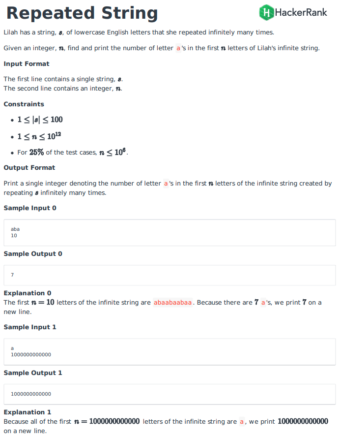

### Question



- **Solution**

    ```tsx
    function repeatedString(s, n) {
        let str_len = s.length;
        let repeat_time = parseInt(n / str_len);
        let remaining = n - (repeat_time * str_len);
        let num_of_a = 0;
        for (let i = 0; i < str_len; i++) if (s[i] == 'a') num_of_a++;
        num_of_a = num_of_a * repeat_time
        for (let i = 0; i < remaining; i++) if (s[i] == 'a') num_of_a++
        return num_of_a;
    }
    ```

    **How does it work?**

    - First, we calculate how many `a` in the string `s`
    - We divides `n` by the string length to get the how many times the string will be repeated.
    - Also, the repeated time may not be an integer, so we need to calculate the remainings.
    - Then, we can simply multipy the `num_of_a` in the `s` with the `repeat_time`
    - For the remaining parts, we do a simple loop to see how many `a` hits, also add to the `num_of_a`
    - Finally, return result `num_of_a`

    **Analysis**

    **Time Complexity:** O(n)

    **Space Complexity:** O(1)