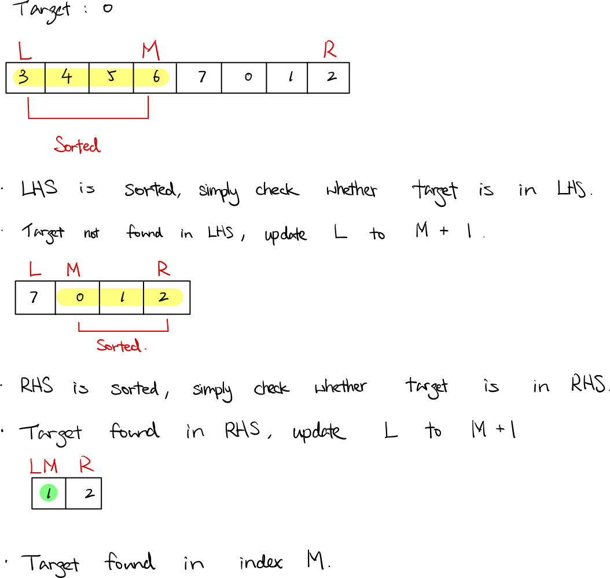

### Question

You are given an integer array `nums` sorted in ascending order, and an integer `target`.

Suppose that `nums` is rotated at some pivot unknown to you beforehand (i.e., `[0,1,2,4,5,6,7]` might become `[4,5,6,7,0,1,2]`).

*If `target` is found in the array return its index, otherwise, return `-1`.*

**Example 1:**

```
Input: nums = [4,5,6,7,0,1,2], target = 0
Output: 4

```

**Example 2:**

```
Input: nums = [4,5,6,7,0,1,2], target = 3
Output: -1

```

**Example 3:**

```
Input: nums = [1], target = 0
Output: -1

```

**Constraints:**

- `1 <= nums.length <= 5000`
- `10^4 <= nums[i] <= 10^4`
- All values of `nums` are **unique**.
- `nums` is guranteed to be rotated at some pivot.
- `10^4 <= target <= 10^4`
- **Solution**

    ```tsx
    function search(nums: number[], target: number): number {
        if (nums.length == 1 && nums[0] == target) return 0;

        let left = 0;
        let right = nums.length - 1;
        
        while (right >= left) {
            let mid = left + Math.floor((right - left)/ 2);
            
            if (nums[mid] == target) return mid;
            
            if (nums[left] <= nums[mid]) {
                // LHS sorted
                if (target < nums[mid] && target >= nums[left]) {
                    right = mid - 1;
                } else {
                    left = mid + 1;
                }
            } else {
                // RHS sorted
                if (target > nums[mid] && target <= nums[right]) {
                    left = mid + 1;
                } else {
                    right = mid - 1;
                }
            }
            
        }
        
        return -1;
    };
    ```

    **How does it work?**

    

    

    **Analysis**

    **Time Complexity:** O(log n)

    **Space Complexity:** O(1)