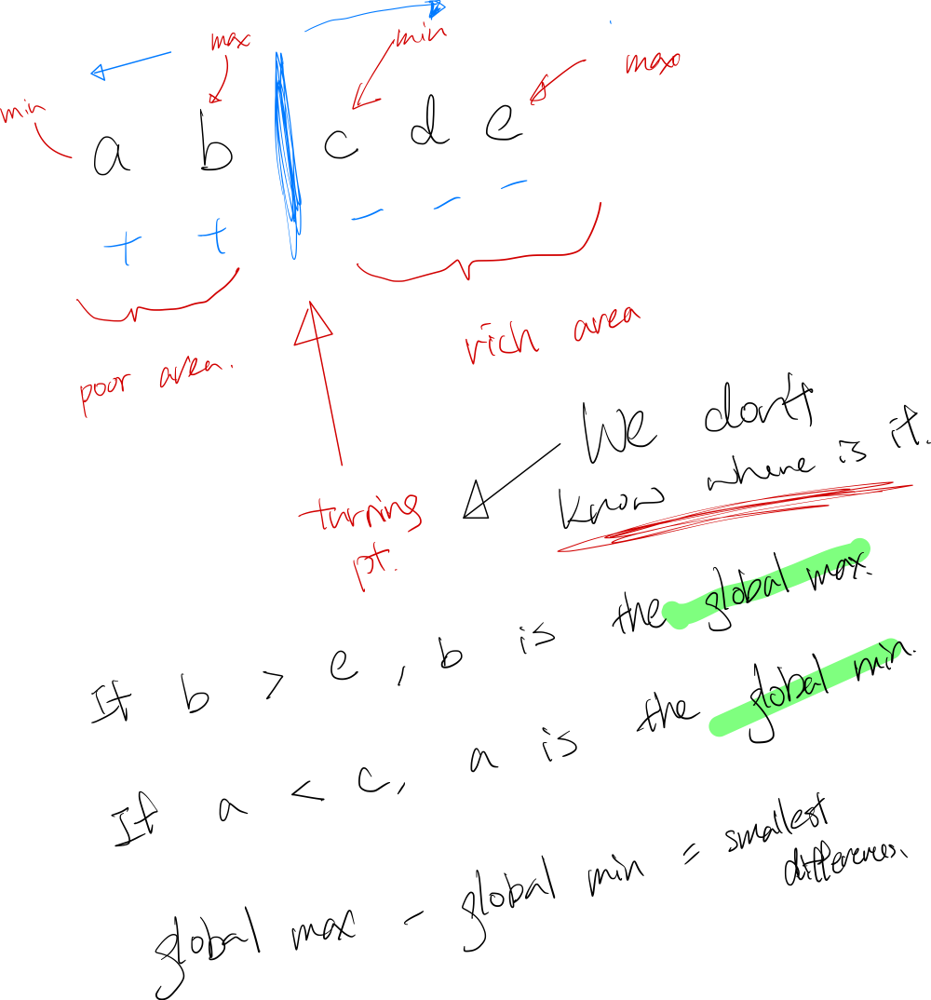

### Question


- **Solution**

    ```tsx
    function smallestRangeII(A: number[], K: number): number {
        A.sort((a, b) => a - b);
        const n = A.length;
        let ans = A[n - 1] - A[0]
        for(let i = 0; i < n - 1; i++) {
            let max = Math.max(A[i] + K, A[n - 1] - K);
            let min = Math.min(A[0] + K, A[i + 1] - K);
            ans = Math.min(max - min, ans);
        }
        return ans;
    };
    ```

    **How does it work?**

    
    By observation, the goal is to make all elements to be more “average”, such that it would has smaller differences between the max and min. Also, we know that there is no point to minus k to the small numbers and add k to the big numbers, it would only generate larger differences. From this, we now have a ground truth, `add k to small numbers, minus k to big numbers`. With that in mind, we can divide the sorted array in to 2 sections, always add k to the small numbers and minus k to the big numbers, but we don’t know the pivot. The idea to find the pivot is to go thru each element, get the intermediate global max, min and find the smallest differences.
    **Analysis**

    **Time Complexity:** O(n log n)

    **Space Complexity:** O(1)

**Lesson Learned**

- In JS, sort is default to treat element as string.
- Based on the observation, some base truth, derive solution from it