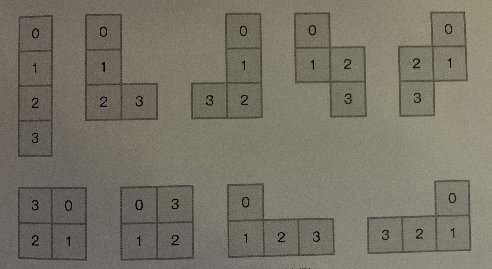

### Question

A sweeping robot can only moving in 4 directions (Forward, Backward, Left and Right). Given that it can only move N times and should avoid visited positions, calculate the number of all possible moving paths when N is 12.

I.e. N = 3, if the robot goes backward first, it would havd 9 possible paths, shown as below.



The total possible paths of N = 3 is 36.

- **Solution**

    ```tsx
    let directions = [
        [-1, 0], // backward
        [1, 0],  // forward
        [0, 1],  // right
        [0, -1], // left
    ];

    let count = 0;
    let N = 12;

    function move(curY: number, curX: number, visited: Set<string>) {
        if (visited.size == N + 1) {
            count++;
            return;
        }
        // move to each direction
        for (let i = 0; i < directions.length; i++) {
            const direction = directions[i];
            const newY = curY +  direction[0];
            const newX = curX +  direction[1];
            if (!visited.has(`${newY}-${newX}`)) {
                const cloneVisited = new Set(visited);
                cloneVisited.add(`${newY}-${newX}`)
                move(newY, newX, cloneVisited);
            }
        }
    }

    move(0, 0, new Set<string>([`0-0`]));
    console.log(count);
    ```

    **How does it work?**

    For each position, It goes to every non visited directions and keep geting deeper until visited 12 positions, it would then increase the count by 1.

    1. Start from 0,0
    2. Visit each non-visited directions, either forward, backward, left and right.
    3. Keep getting deeper til visited 12 new positions, add count by 1.

    **Analysis**

    **Time Complexity:** O(4 * 3 ^ (N-1))

    **Space Complexity:** O(4 * 3 ^ (N-1))

**Lesson Learnt**

-