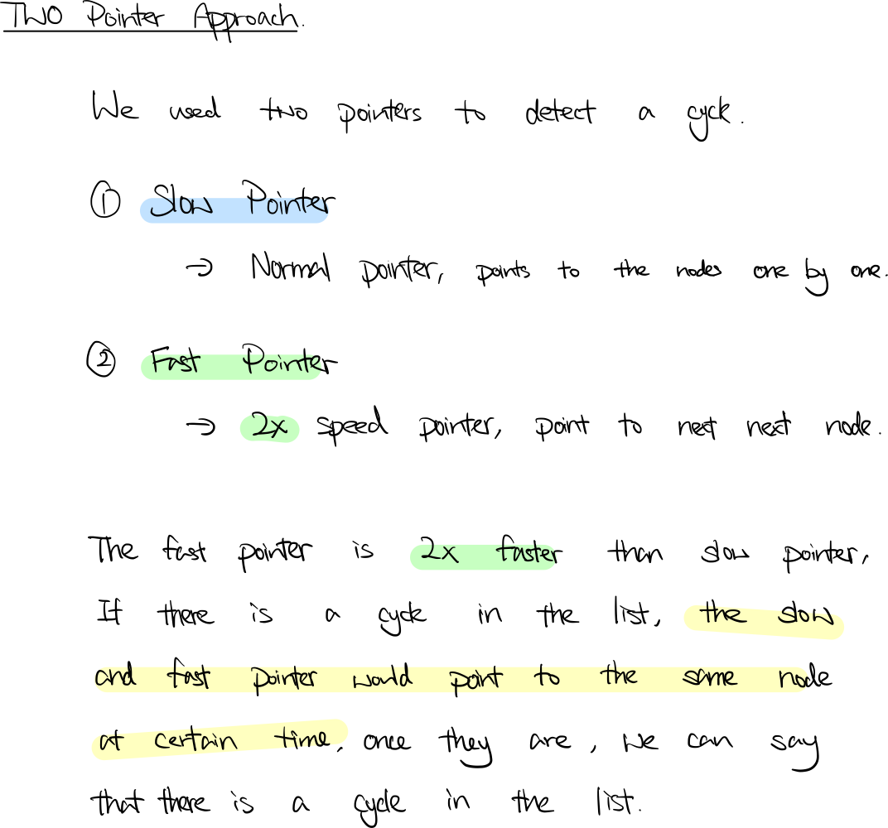

### Question

Given `head`, the head of a linked list, determine if the linked list has a cycle in it.

There is a cycle in a linked list if there is some node in the list that can be reached again by continuously following the `next` pointer. Internally, `pos` is used to denote the index of the node that tail's `next` pointer is connected to. **Note that `pos` is not passed as a parameter**.

Return `true` *if there is a cycle in the linked list*. Otherwise, return `false`.

**Example 1:**


```
Input: head = [3,2,0,-4], pos = 1
Output: true
Explanation: There is a cycle in the linked list, where the tail connects to the 1st node (0-indexed).
```

**Example 2:**


```
Input: head = [1,2], pos = 0
Output: true
Explanation: There is a cycle in the linked list, where the tail connects to the 0th node.
```

**Example 3:**


```
Input: head = [1], pos = -1
Output: false
Explanation: There is no cycle in the linked list.
```

**Constraints:**

- The number of the nodes in the list is in the range `[0, 104]`.
- `105 <= Node.val <= 105`
- `pos` is `1` or a **valid index** in the linked-list.

**Follow up:** Can you solve it using `O(1)` (i.e. constant) memory?

- **Solution**

    ```tsx
    /**
     * Definition for singly-linked list.
     * class ListNode {
     *     val: number
     *     next: ListNode | null
     *     constructor(val?: number, next?: ListNode | null) {
     *         this.val = (val===undefined ? 0 : val)
     *         this.next = (next===undefined ? null : next)
     *     }
     * }
     */

    function hasCycle(head: ListNode | null): boolean {
        if (!head) return false;
        
        let slow = head;
        let fast = head.next;
        
        while (slow != fast) {
            if (fast == null || fast.next == null) return false;
            slow = slow.next;
            fast = fast.next.next;
        }
        
        return true;
    };
    ```

    **How does it work?**

    

    **Analysis**

    **Time Complexity:** O(n)

    **Space Complexity:** O(1)

**Lesson Learnt**

- Slow fast pointer usage