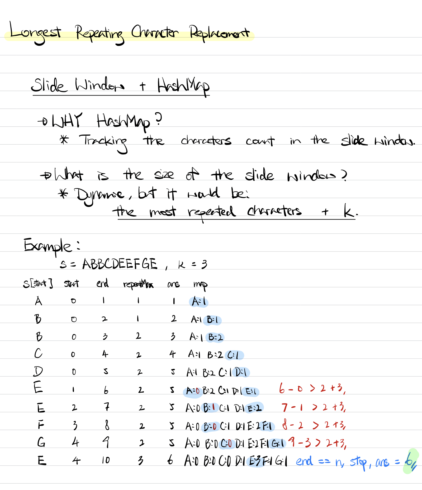

### Question

Given a string `s` that consists of only uppercase English letters, you can perform at most `k` operations on that string.

In one operation, you can choose **any** character of the string and change it to any other uppercase English character.

Find the length of the longest sub-string containing all repeating letters you can get after performing the above operations.

**Note:**Both the string's length and k will not exceed 104.

**Example 1:**

```
Input:
s = "ABAB", k = 2

Output:
4

Explanation:
Replace the two 'A's with two 'B's or vice versa.
```

**Example 2:**

```
Input:
s = "AABABBA", k = 1

Output:
4

Explanation:
Replace the one 'A' in the middle with 'B' and form "AABBBBA".
The substring "BBBB" has the longest repeating letters, which is 4.
```

- **Solution**

    ```tsx
    function characterReplacement(s: string, k: number): number {
        const n = s.length;
        const charCount = {};
        
        let start = 0;
        let end = 0;
        let max = 0;
        let maxRepeatingCount = 0;
        
        while (end < n) {
            if (!charCount[s[end]]) charCount[s[end]] = 0
            charCount[s[end]]++
            maxRepeatingCount = Math.max(maxRepeatingCount, charCount[s[end]]);        
            end++;
            if (end - start > maxRepeatingCount + k) {
                charCount[s[start]]--
                start++;
            }
            max = Math.max(end - start, max)
        }
        
        return max;
        
    };
    ```

    **How does it work?**

    

    Another example to find a longest substring using slide window technique. Here, we used slide window plus a HashMap to find the longest repeating character replacement.

    The length of the longest substring would be the most repeated characters + k.

    To find the most repeated characters, it goes thru each characters and use a hashmap to store the character count. Since the length would be the most repeated characters + k, so we would update the size of the slide window on the fly. If the current **end - start** is greater than the size of slide window (**repeated max + k**), move the start pointer (start + 1) and remove the character count in the hashmap.

    **Analysis**

    **Time Complexity:** O(n)

    **Space Complexity:** O(n)

**Lesson Learnt**

- Use slide window with other data structure to solve different problem.