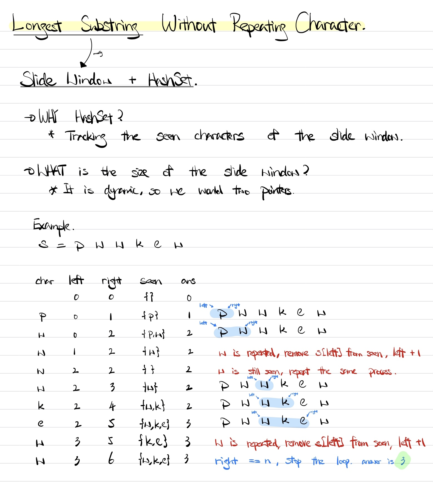

### Question

Given a string `s`, find the length of the **longest substring** without repeating characters.

**Example 1:**

```
Input: s = "abcabcbb"
Output: 3
Explanation: The answer is "abc", with the length of 3.

```

**Example 2:**

```
Input: s = "bbbbb"
Output: 1
Explanation: The answer is "b", with the length of 1.

```

**Example 3:**

```
Input: s = "pwwkew"
Output: 3
Explanation: The answer is "wke", with the length of 3.
Notice that the answer must be a substring, "pwke" is a subsequence and not a substring.

```

**Example 4:**

```
Input: s = ""
Output: 0

```

**Constraints:**

- `0 <= s.length <= 5 * 104`
- `s` consists of English letters, digits, symbols and spaces.
- **One Pass Solution**

    ```tsx
    function onePass(s: string) {
        const n = s.length;
        const seen = new Set<string>();
        let ans = 0;
        let left = 0;
        let right = 0;
        while (left < n && right < n) {
            if (seen.has(s[right])) {
                // repeated character found
                // 1. remove the left pointer character from the seen set
                // 2. update left + 1
                // 1 and 2 would be repeated util repeated character has been deleted
                seen.delete(s[left++]);
            } else {
                seen.add(s[right++]);
                ans = Math.max(ans, right - left)
            }
        }
        return ans;
    }
    ```

    **How does it work?**

    

    **Analysis**

    **Time Complexity:** O(n)

    **Space Complexity:** O(n)

**Lesson Learnt**

- Slide window is often used in solving finding the longest substring.
- Slide window + Hashset is a combination to keep track the seen characters in the slide window.
- Slide window is same as 2 two pointers.