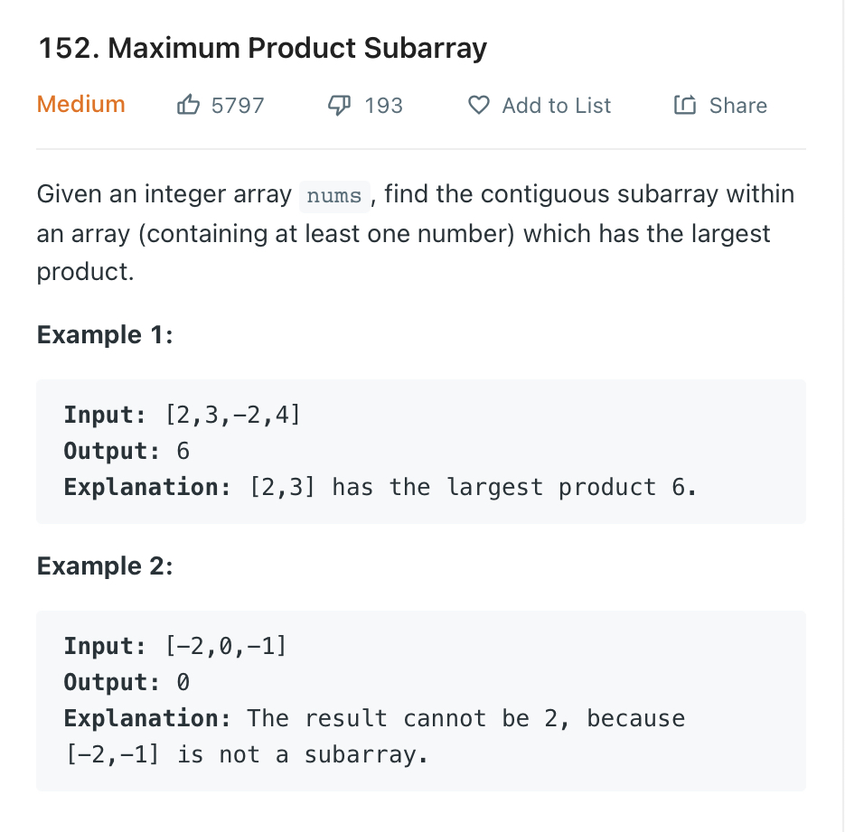

### Question



- **Solution**

    ```tsx
    function maxProduct(nums: number[]): number {
        let prev_max = nums[0];
        let prev_min = nums[0];
        let ans = nums[0];
        
        for (let i = 1; i < nums.length; i++) {
            let curr_max = Math.max(Math.max(prev_max * nums[i], prev_min * nums[i], nums[i]));
            let curr_min = Math.min(Math.min(prev_max * nums[i], prev_min * nums[i], nums[i]));
            ans = Math.max(curr_max, ans);
            prev_max = curr_max;
            prev_min = curr_min;
        }
        return ans;
    };
    ```

    **How does it work?**

    

    **Analysis**

    **Time Complexity:** O(n)

    **Space Complexity:** O(1)
