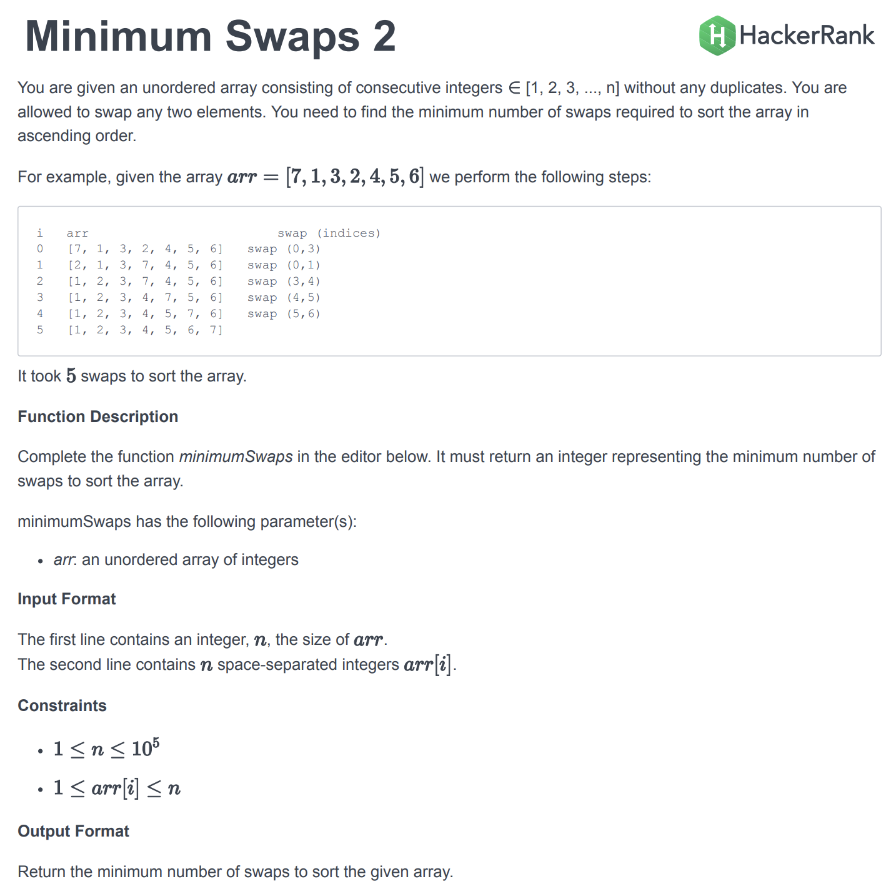
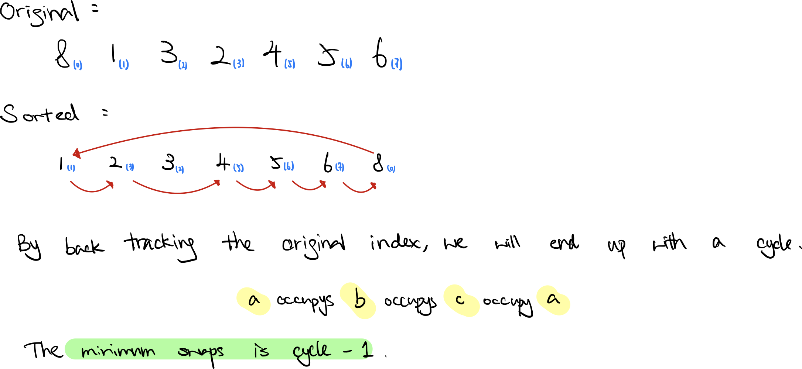

### Question



- **Occupied Cycle Solution**

    ```tsx
    function minimumSwaps(arr) {
        const seen = new Set();
        const sortedPairs = [];
        
        // create a sorted version with original position
        arr.forEach((v, i) => sortedPairs.push([v, i]));
        // sort pairs O(n lg n)
        sortedPairs.sort((a, b) => a[0] - b[0]);
        
        let ans = 0;
        // find the cycle
        for(let i = 0; i < sortedPairs.length; i++) {
            if (seen.has(i) || sortedPairs[i][1] == i) continue;
            
            let cycle = 0;
            let j = i;
            
            while(!seen.has(j)) {
                seen.add(j);
                j = sortedPairs[j][1];
                cycle++;
            }
            ans += cycle - 1;
        }
        return ans;
    }
    ```

    **How does it work?**

    


    **Analysis**

    **Time Complexity:** O(n log n) 

    **Space Complexity:** O(1)

**Lesson Learned**

- Find the occupied cycle, a ⇒ b ⇒ c ⇒ a
- Could sort an array first.