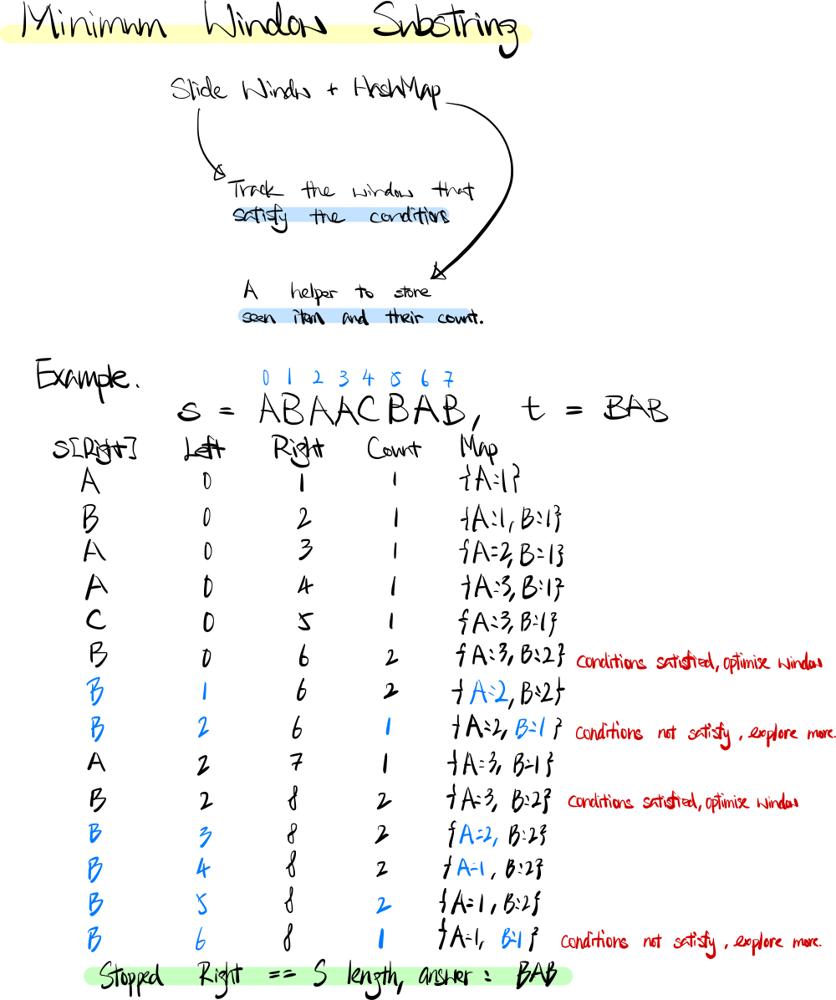

### Question

Given two strings `s` and `t`, return *the minimum window in `s` which will contain all the characters in `t`*. If there is no such window in `s` that covers all characters in `t`, return *the empty string `""`*.

**Note** that If there is such a window, it is guaranteed that there will always be only one unique minimum window in `s`.

**Example 1:**

```
Input: s = "ADOBECODEBANC", t = "ABC"
Output: "BANC"

```

**Example 2:**

```
Input: s = "a", t = "a"
Output: "a"

```

**Constraints:**

- `1 <= s.length, t.length <= 105`
- `s` and `t` consist of English letters.

**Follow up:**

Could you find an algorithm that runs in O(n)

time?

- **Sliding Window + HashMap Solution**

    ```tsx
    function minWindow(s: string, t: string): string {
        // Solution: slide window + hash map
        
        return slidingWindow(s, t);
    };

    function slidingWindow(s: string, t: string): string {
        // Answer, window size, left and right pointer
        let ans = [-1, -1, -1];
        // Windown hash map, store seen char and it count
        let windowMap = new Map<string, number>();
        // Target hash map
        let targetMap = new Map<string, number>();
        // Expected conditions should be satisfied in slide window
        let expected = 0;
        
        // Initialize the target hash map
        for (let i = 0; i < t.length; i++) {
            if (!targetMap.get(t[i])) {
                windowMap.set(t[i], 0);
                targetMap.set(t[i], 0);
                expected++;
            }
            targetMap.set(t[i], targetMap.get(t[i]) + 1);
        }
        
        // Slide window pointers
        let left = 0; 
        let right = 0;
        
        // No. of character target met
        let conditions = 0;
        
        while(right < s.length) {
            if (targetMap.has(s[right])) {
                // Increase seen char in window map
                windowMap.set(s[right], windowMap.get(s[right]) + 1 );
                // Increase condition met count if target character count met
                if (windowMap.get(s[right]) === targetMap.get(s[right]))
                    conditions++;
                // Check if conditions met and Optimise the window size
                while (right >= left && conditions === expected) {
                    if (targetMap.has(s[left])) {
                        if (right - left + 1 < ans[0] || ans[0] === -1) {
                            // new minimum found
                            ans[0] = right - left + 1;
                            ans[1] = left;
                            ans[2] = right;
                        }
                        
                        windowMap.set(s[left], windowMap.get(s[left]) - 1);    

                        // Decrease the conditions if target character count not match anymore
                        if (windowMap.get(s[left]) < targetMap.get(s[left]))
                            conditions--;
                    }
                    // Move forward the left counter, shrink the window size
                    left++;
                }
            }
            // Explore more element if there is
            right++;
        }
        
        return ans[0] === -1 ? "" : s.substring(ans[1], ans[2] + 1);
    }
    ```

    **How does it work?**

    

    **Analysis**

    **Time Complexity:** O(|S| + |T|) ⇒ ****O(n)

    **Space Complexity:** O(2 * |T|) ⇒ ****O(n)

**Lesson Learnt**

- Learnt how to use hashmap to check whether the target meet.
    - A hash map + a unique char counter