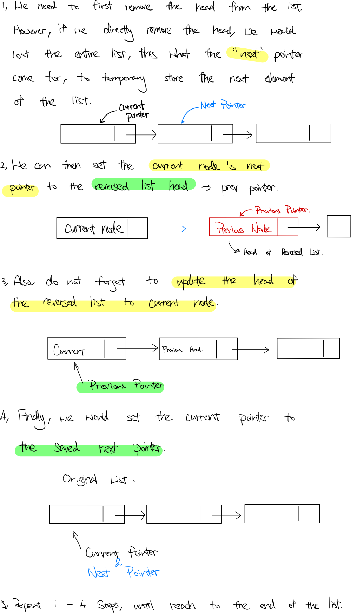

### Question

Reverse a singly linked list.

**Example:**

```
Input: 1->2->3->4->5->NULL
Output: 5->4->3->2->1->NULL
```

**Follow up:**

A linked list can be reversed either iteratively or recursively. Could you implement both?

- **Iterative Solution**

    ```tsx
    /**
     * Definition for singly-linked list.
     * class ListNode {
     *     val: number
     *     next: ListNode | null
     *     constructor(val?: number, next?: ListNode | null) {
     *         this.val = (val===undefined ? 0 : val)
     *         this.next = (next===undefined ? null : next)
     *     }
     * }
     */

    function reverseList(head: ListNode | null): ListNode | null {
        let curr = head;
        let prev = null;
        let next = null;
        while (curr) {
            next = curr.next
            curr.next = prev;
            prev = curr;
            curr = next;
        }
        return prev;
    };
    ```

    **How does it work?**

    

    **Analysis**

    **Time Complexity:** O(n)

    **Space Complexity:** O(1)

**Lesson Learnt**

-