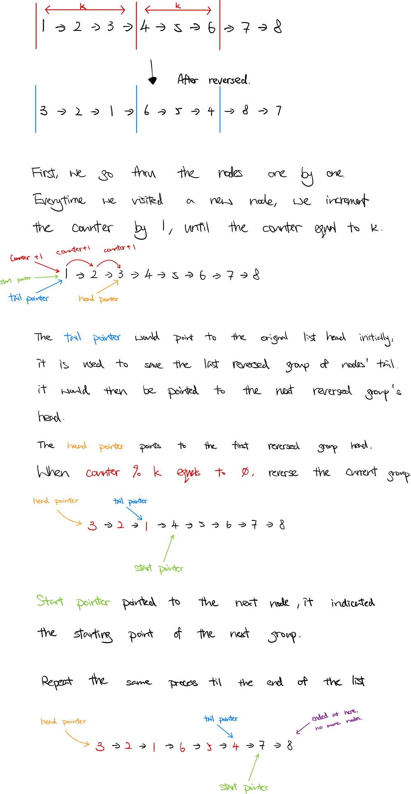

### Question

Given a linked list, reverse the nodes of a linked list *k* at a time and return its modified list.

*k* is a positive integer and is less than or equal to the length of the linked list. If the number of nodes is not a multiple of *k* then left-out nodes, in the end, should remain as it is.

**Follow up:**

- Could you solve the problem in `O(1)` extra memory space?
- You may not alter the values in the list's nodes, only nodes itself may be changed.

**Example 1:**


```
Input: head = [1,2,3,4,5], k = 2
Output: [2,1,4,3,5]

```

**Example 2:**


```
Input: head = [1,2,3,4,5], k = 3
Output: [3,2,1,4,5]

```

**Example 3:**

```
Input: head = [1,2,3,4,5], k = 1
Output: [1,2,3,4,5]

```

**Example 4:**

```
Input: head = [1], k = 1
Output: [1]

```

**Constraints:**

- The number of nodes in the list is in the range `sz`.
- `1 <= sz <= 5000`
- `0 <= Node.val <= 1000`
- `1 <= k <= sz`
- **Solution**

    ```tsx
    /**
     * Definition for singly-linked list.
     * class ListNode {
     *     val: number
     *     next: ListNode | null
     *     constructor(val?: number, next?: ListNode | null) {
     *         this.val = (val===undefined ? 0 : val)
     *         this.next = (next===undefined ? null : next)
     *     }
     * }
     */

    function reverseKGroup(head: ListNode | null, k: number): ListNode | null {
        let counter = 0;
        let curr = head;
        let start = head;
        let tail = head;

        while (curr) {
            counter++;
            if (counter % k === 0) {
                let next = curr.next;
                let temp = reverseGroup(k, start, curr);
                if (counter === k) {
                    head = temp;
                } else {
                    tail.next = temp
                    tail = start;
                }
                
                start = next;
                curr = next;
            } else curr = curr.next;
        }
        
        return head;
    };

    function reverseGroup(k: number, start: ListNode, end: ListNode): ListNode {
        let next;
        let prev = end.next;
        let curr = start;
        while (k-- > 0) {
            next = curr.next;
            curr.next = prev;
            prev = curr;
            curr = next;
        }
        return prev;
    }
    ```

    **How does it work?**

    

    **Analysis**

    **Time Complexity:** O(2n)

    **Space Complexity:** O(1)

**Lesson Learnt**

-