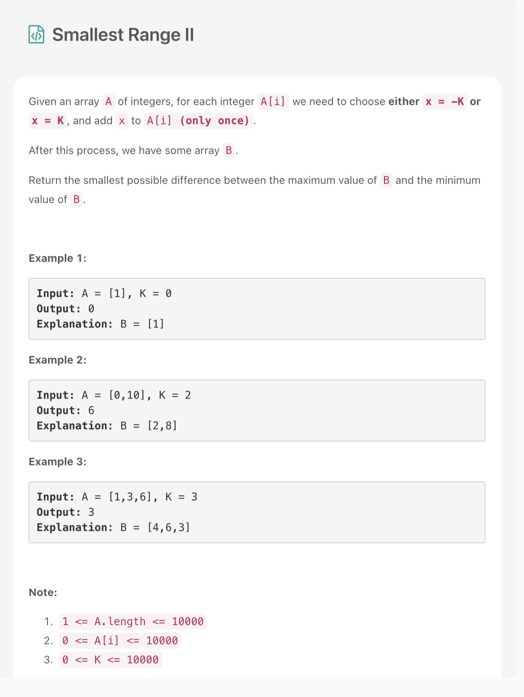
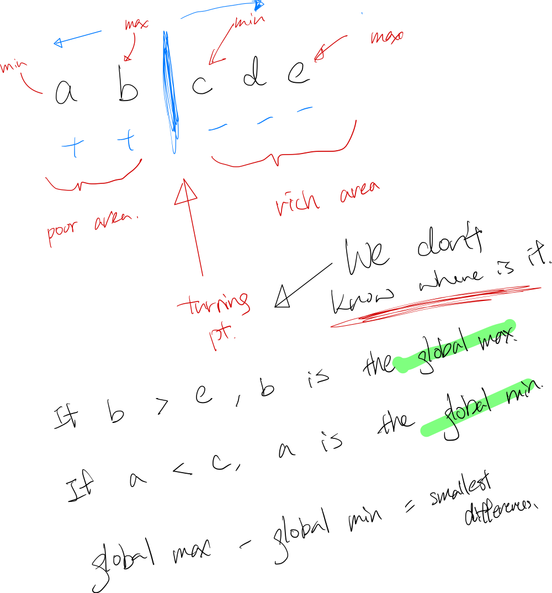

### Question



- **Solution**

    ```tsx
    function smallestRangeII(A: number[], K: number): number {
        A.sort((a, b) => a - b);
        const n = A.length;
        let ans = A[n - 1] - A[0]
        for(let i = 0; i < n - 1; i++) {
            let max = Math.max(A[i] + K, A[n - 1] - K);
            let min = Math.min(A[0] + K, A[i + 1] - K);
            ans = Math.min(max - min, ans);
        }
        return ans;
    };
    ```

    **How does it work?**

    

    **Analysis**

    **Time Complexity:** O(n log n)

    **Space Complexity:** O(1)

**Lesson Learned**

- In JS, sort is default to treat element as string.
- Based on the observation, some base truth, derive solution from it